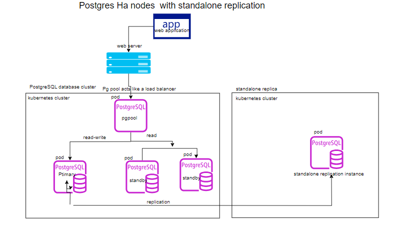

# Postgres High Availability deployment using Helm Charts
This deployment uses the postgresql-ha chart from Bitnami.

This is the architectural diagram of how the solution looks like.


##  Instructions to deploy Ha and standalone replication 

### Prerequisites

- Minikube v1.34.0
- Helm 3.15.2
- Docker 27.3.1

#### Set Up Minikube (powershell)
- Install Minikube:
 ```
choco install minikube
 ```
- Start Minikube:
 ```
minikube start --cpus=2 --memory=2048 --disk-size=20g --driver=docker
 ```
- Verify Minikube is running:
 ```
minikube status
 ```
- Check Cluster Status
```
kubectl cluster-info

```
### Installing Postgres HA using Helm chart

- Add bitnami repository
```
helm repo add bitnami https://charts.bitnami.com/bitnami
helm repo update
```
- Install postgresql-ha chart and pgdb cluster
```
helm install pgdb-cluster oci://registry-1.docker.io/bitnamicharts/postgresql-ha
```


- Output

```
PostgreSQL can be accessed through Pgpool via port 5433 on the following DNS within the cluster:
pgdb-cluster-postgresql-ha-pgpool.default.svc.cluster.local

Postgres Password:
export POSTGRES_PASSWORD=$(kubectl get secret --namespace default pgdb-cluster-postgresql-ha-postgresql -o jsonpath="{.data.password}" | base64 -d)

Repmgr Password:
export REPMGR_PASSWORD=$(kubectl get secret --namespace default pgdb-cluster-postgresql-ha-postgresql -o jsonpath="{.data.repmgr-password}" | base64 -d)

To connect to the  database from outside the cluster:
    kubectl port-forward --namespace default svc/pgdb-cluster-postgresql-ha-pgpool 5433:5432 &
    psql -h 127.0.0.1 -p 5433 -U postgres -d postgres
```
Pgpool acts as a load balancer for PostgreSQL and forward read/write connections to the primary node while read-only connections are forwarded to standby nodes.
-Pgpool  connection parameters:
```
kubectl get secret --namespace default pgdb-cluster-postgresql-ha-postgresql -o jsonpath="{.data.password}" | base64 -d
kubectl port-forward --namespace default svc/pgdb-cluster-postgresql-ha-pgpool 5433:5432 &
psql -h 127.0.0.1 -p 5433 -U postgres -d postgres
```
- Output
```
export POSTGRES_PASSWORD=$(kubectl get secret --namespace default pgdb-cluster-postgresql-ha-postgresql -o jsonpath="{.data.password}" | base64 -d)kubectl port-forward --namespace default svc/pgdb-cluster-postgresql-ha-pgpool 5433:5432 &
psql -h 127.0.0.1 -p 5433 -U postgres -d postgres
[1] 1075
Forwarding from 127.0.0.1:5433 -> 5432
Forwarding from [::1]:5433 -> 5432
Handling connection for 5433
Password for user postgres: Handling connection for 5433


psql (17.2)
WARNING: Console code page (437) differs from Windows code page (1252)
         8-bit characters might not work correctly. See psql reference
         page "Notes for Windows users" for details.
Type "help" for help.

postgres=#
```
- Verify the pods
```
kubectl get pod
```


- Connecting Service

```
kubectl get svc
NAME                                             TYPE      
kubernetes                                       ClusterIP      
pgdb-cluster-postgresql-ha-pgpool                ClusterIP        
pgdb-cluster-postgresql-ha-postgresql            ClusterIP         
pgdb-cluster-postgresql-ha-postgresql-headless   ClusterIP          
```

- To connect from the local machine, forward the listening port;

```
kubectl port-forward --namespace default svc/pgdb-cluster-postgresql-ha-pgpool 5434:5432
```

- Retrieve database password:
```
kubectl get secret --namespace default pgdb-cluster-postgresql-ha-postgresql -o jsonpath="{.data.password}" | base64 -d
```
Connect to the database using psql on localhost to pgpool.
```
psql -h 127.0.0.1 -p 5434 -U postgres -d postgres
```
- Output
```
Password for user postgres:

psql (17.2)
WARNING: Console code page (437) differs from Windows code page (1252)
         8-bit characters might not work correctly. See psql reference
         page "Notes for Windows users" for details.
Type "help" for help.

postgres=# 

```
- Status of the other nodes.

```console
show pool_nodes;
```
- Output

```
postgres=# show pool_nodes;
 node_id |                                        hostname                                        | port | status | pg_stat
us | lb_weight |  role   | pg_role | select_cnt | load_balance_node | replication_delay | replication_state | replication_s
ync_state | last_status_change
 0       | pgdb-cluster-postgresql-ha-postgresql-0.pgdb-cluster-postgresql-ha-postgresql-headless | 5432 | up     | up     
   | 0.333333  | primary | primary | 64         | true              | 0                 |                   |
          | 2024-12-02 13:37:36
 1       | pgdb-cluster-postgresql-ha-postgresql-1.pgdb-cluster-postgresql-ha-postgresql-headless | 5432 | up     | up     
   | 0.333333  | standby | standby | 52         | false             | 0                 |                   |
          | 2024-12-02 13:38:32
 2       | pgdb-cluster-postgresql-ha-postgresql-2.pgdb-cluster-postgresql-ha-postgresql-headless | 5432 | up     | up     
   | 0.333333  | standby | standby | 51         | false             | 0                 |                   |
          | 2024-12-02 13:38:22
(3 rows)
```


#### Expose the pgpool Service to the  Local Machine


```
kubectl port-forward svc/pgdb-cluster-postgresql-ha-pgpool 5434:5432
```

- Output

```
kubectl port-forward --namespace default svc/pgdb-cluster-postgresql-ha-pgpool 5434:5432
Forwarding from 127.0.0.1:5434 -> 5432
Forwarding from [::1]:5434 -> 5432
Handling connection for 5434
Handling connection for 5434
Handling connection for 5434
Handling connection for 5434
Handling connection for 5434
Handling connection for 5434
Handling connection for 5434
Handling connection for 5434
Handling connection for 5434
Handling connection for 5434


```
This command will forward port `5434` from the `pgpool` service in Kubernetes to the local machine. This means the local machine can connect to PostgreSQL through `localhost:5434`.


####  Running the Script
- install  psycopg2 and faker utilities

```
pip install psycopg2 faker
```
- Run the python script
This scripts creates a new database if it does not exist, 2 tables each linked by primary and foreign keys. It then generates and inserts 100000 new records.
```bash
python dbload.py
```
- Output
```
 python dbload.py 
Database 'library' does not exist. Creating it now...
Database 'library' created successfully.
Tables created successfully!
Inserted 100000 records into 'authors' and 'books'.
Database population complete.

```
#### Verify the Data

```sql
SELECT count(*) FROM books;
SELECT count (*)  FROM authors;
```
- Output

```
library=# SELECT count(*) FROM books;
 count
--------
 100000
(1 row)


library=# SELECT count (*)  FROM authors;
 count
-------
 10000
(1 row)

```
### Verify the database has been created on primary node:

- On pgdb-cluster-postgresql-ha-postgresql-0 primary node.

```
kubectl exec -it pgdb-cluster-postgresql-ha-postgresql-0  -- psql -U postgres
```
- Output

```
kubectl exec -it pgdb-cluster-postgresql-ha-postgresql-0  -- psql -U postgres
Password for user postgres: 

postgres=# \l
                                                     List of databases
   Name    |  Owner   | Encoding | Locale Provider |   Collate   |    Ctype    | Locale | ICU Rules |   Access privileges  
-
 library   | postgres | UTF8     | libc            | en_US.UTF-8 | en_US.UTF-8 |        |           | 
 postgres  | postgres | UTF8     | libc            | en_US.UTF-8 | en_US.UTF-8 |        |           |
 repmgr    | postgres | UTF8     | libc            | en_US.UTF-8 | en_US.UTF-8 |        |           |
 template0 | postgres | UTF8     | libc            | en_US.UTF-8 | en_US.UTF-8 |        |           | =c/postgres

postgres=# \c library 
You are now connected to database "library" as user "postgres".
library=# \dt
          List of relations
 Schema |  Name   | Type  |  Owner
--------+---------+-------+----------
 public | authors | table | postgres
 public | books   | table | postgres

library=# select count(*) from books;
 count  
--------
 100000

library=# SELECT * FROM pg_stat_replication;
 pid | usesysid | usename |            application_name             | client_addr |                         client_hostname
                         | client_port |         backend_start         | backend_xmin |   state   | sent_lsn  | write_lsn |
 flush_lsn | replay_lsn | write_lag | flush_lag | replay_lag | sync_priority | sync_state |          reply_time

 422 |    16384 | repmgr  | pgdb-cluster-postgresql-ha-postgresql-2 | 10.244.0.13 | pgdb-cluster-postgresql-ha-postgresql-2
.pgdb-cluster-postgresql |       51350 | 2024-12-03 16:34:56.445822+00 |              | streaming | 0/F7093E8 | 0/F7093E8 |
 0/F7093E8 | 0/F7093E8  |           |           |            |             0 | async      | 2024-12-03 17:29:43.287833+00  
 429 |    16384 | repmgr  | pgdb-cluster-postgresql-ha-postgresql-1 | 10.244.0.14 | 10-244-0-14.pgdb-cluster-postgresql-ha-
postgresql.default.svc.c |       39426 | 2024-12-03 16:34:58.628634+00 |              | streaming | 0/F7093E8 | 0/F7093E8 |
 0/F7093E8 | 0/F7093E8  |           |           |            |             0 | async      | 2024-12-03 17:29:43.33786+00   

library=# 

```


### Verify sychronization with standby nodes:
- On pgdb-cluster-postgresql-ha-postgresql-1 standby node.

```
kubectl exec -it pgdb-cluster-postgresql-ha-postgresql-1  -- psql -U postgres
```
- Output

```
kubectl exec -it pgdb-cluster-postgresql-ha-postgresql-1  -- psql -U postgres 
Password for user postgres: 
postgres=# SELECT * FROM pg_stat_wal_receiver;
 pid |  status   | receive_start_lsn | receive_start_tli | written_lsn | flushed_lsn | received_tli |      last_msg_send_ti
me       |     last_msg_receipt_time     | latest_end_lsn |        latest_end_time        |    slot_name     |
                                      sender_host                                                    | sender_port |       

 236 | streaming | 0/E000000         |                 1 | 0/F7093E8   | 0/F7093E8   |            1 | 2024-12-03 17:11:43.0
81872+00 | 2024-12-03 17:11:43.082103+00 | 0/F7093E8      | 2024-12-03 17:06:43.021008+00 | repmgr_slot_1001 | pgdb-cluster
-postgresql-ha-postgresql-0.pgdb-cluster-postgresql-ha-postgresql-headless.default.svc.cluster.local |        5432 | user=r
epmgr password=******** channel_binding=prefer connect_timeout=5 dbname=replication host=pgdb-cluster-postgresql-ha-postgre
sql-0.pgdb-cluster-postgresql-ha-postgresql-headless.default.svc.cluster.local port=5432 application_name=pgdb-cluster-post
gresql-ha-postgresql-1 fallback_application_name=walreceiver sslmode=prefer sslnegotiation=postgres sslcompression=0 sslcer
tmode=allow sslsni=1 ssl_min_protocol_version=TLSv1.2 gssencmode=disable krbsrvname=postgres gssdelegation=0 target_session
_attrs=any load_balance_hosts=disable
(1 row)

postgres=# \l
                                                     List of databases
   Name    |  Owner   | Encoding | Locale Provider |   Collate   |    Ctype    | Locale | ICU Rules |   Access privileges  
-
 library   | postgres | UTF8     | libc            | en_US.UTF-8 | en_US.UTF-8 |        |           |
 postgres  | postgres | UTF8     | libc            | en_US.UTF-8 | en_US.UTF-8 |        |           |
 repmgr    | postgres | UTF8     | libc            | en_US.UTF-8 | en_US.UTF-8 |        |           |
 
postgres=# \c library
You are now connected to database "library" as user "postgres".
library=# \dt
          List of relations
 Schema |  Name   | Type  |  Owner
--------+---------+-------+----------
 public | authors | table | postgres
 public | books   | table | postgres

library=# select count(*) from books;
 count  
--------
 100000

library=#
```

- On pgdb-cluster-postgresql-ha-postgresql-2 standby node.
```
kubectl exec -it pgdb-cluster-postgresql-ha-postgresql-2 -- psql -U postgres
```
- Output

```
kubectl exec -it pgdb-cluster-postgresql-ha-postgresql-2 -- psql -U postgres
Password for user postgres: 
postgres=# \l
                                                     List of databases
   Name    |  Owner   | Encoding | Locale Provider |   Collate   |    Ctype    | Locale | ICU Rules |   Access privileges  
-
 library   | postgres | UTF8     | libc            | en_US.UTF-8 | en_US.UTF-8 |        |           | 
 postgres  | postgres | UTF8     | libc            | en_US.UTF-8 | en_US.UTF-8 |        |           |
 repmgr    | postgres | UTF8     | libc            | en_US.UTF-8 | en_US.UTF-8 |        |           |
 template0 | postgres | UTF8     | libc            | en_US.UTF-8 | en_US.UTF-8 |        |           | =c/postgres

postgres=# SELECT * FROM pg_stat_wal_receiver;
 pid |  status   | receive_start_lsn | receive_start_tli | written_lsn | flushed_lsn | received_tli |      last_msg_send_ti
me       |     last_msg_receipt_time     | latest_end_lsn |        latest_end_time        |    slot_name     |
                                      sender_host                                                    | sender_port |       

 389 | streaming | 0/E000000         |                 1 | 0/F7093E8   | 0/F7093E8   |            1 | 2024-12-03 17:22:43.1
88154+00 | 2024-12-03 17:22:43.188233+00 | 0/F7093E8      | 2024-12-03 17:06:43.021335+00 | repmgr_slot_1002 | pgdb-cluster
-postgresql-ha-postgresql-0.pgdb-cluster-postgresql-ha-postgresql-headless.default.svc.cluster.local |        5432 | user=r
epmgr password=******** channel_binding=prefer connect_timeout=5 dbname=replication host=pgdb-cluster-postgresql-ha-postgre
sql-0.pgdb-cluster-postgresql-ha-postgresql-headless.default.svc.cluster.local port=5432 application_name=pgdb-cluster-post
gresql-ha-postgresql-2 fallback_application_name=walreceiver sslmode=prefer sslnegotiation=postgres sslcompression=0 sslcer
tmode=allow sslsni=1 ssl_min_protocol_version=TLSv1.2 gssencmode=disable krbsrvname=postgres gssdelegation=0 target_session
_attrs=any load_balance_hosts=disable
(1 row)


postgres=# \c library 
You are now connected to database "library" as user "postgres".
library=# \dt
          List of relations
 Schema |  Name   | Type  |  Owner
--------+---------+-------+----------
 public | authors | table | postgres
 public | books   | table | postgres


library=# select count(*) from books;
 count  
--------
 100000

library=#
```


### Deployment of the standalone replica.

```console
 helm install standalone  bitnami/postgresql --version 16.2.3
```
- Output
```

PostgreSQL can be accessed via port 5435 on the following DNS names :
standalone-postgresql.default.svc.cluster.local - Read/Write connection

To get the password for "postgres" 
export POSTGRES_PASSWORD=$(kubectl get secret --namespace default standalone-postgresql -o jsonpath="{.data.postgres-password}" | base64 -d)

To connect to the database from outside,
kubectl port-forward --namespace default svc/standalone-postgresql 5435:5432 &
PGPASSWORD="$POSTGRES_PASSWORD" psql --host 127.0.0.1 -U postgres -d postgres -p 5435
```

- Check the status of the instance 

```
helm ls
helm status standalone
```
- connect to the standalone instance:
- forward the connection port to connect outside the cluster.

```
kubectl port-forward --namespace default svc/standalone-postgresql 5435:5432
```
- connect to the database:

```
psql --host 127.0.0.1 -U postgres -d postgres -p 5435
```

### Configuring replication between HA and Standalone instances.

 - Identify the primary node in the HA cluster:
```bash
kubectl exec -it pgdb-cluster-postgresql-ha-pgpool  -- psql -U postgres -c "SHOW pool_nodes;"
```

### Allow Replication Connections

**Update `pg_hba.conf` in the HA Cluster Pods**:
```bash
     kubectl edit statefulset pgdb-cluster-postgresql-ha-postgresql     
```
- Add the standalone pod’s IP or service name to the `POSTGRESQL_PGHBA` environment variable:
```  - name: POSTGRESQL_PGHBA
       value: 
         host replication replicator 10.244.0.19 md5
         host all all 0.0.0.0/0 md5
```


###  Create a Replication User
Ensure a user with replication privileges exists in the HA cluster:
```bash
kubectl exec -it pgdb-cluster-postgresql-ha-postgresql-0 -- psql -U postgres -c "CREATE USER repmgr WITH REPLICATION ENCRYPTED PASSWORD 'repmgr';"
```


###  Prepare the Standalone Pod
The standalone instance will act as a replica.

 Stop PostgreSQL:
   ```bash
   kubectl exec -it standalone-postgresql-0 -- bash -c "pg_ctl stop -D /var/lib/postgresql/data"
   ```

 Clear Existing Data:
   ```bash
   kubectl exec -it standalone-postgresql-0 -- bash -c "rm -rf /var/lib/postgresql/data/*"
   ```

- Run `pg_basebackup`:
Use `pg_basebackup` to replicate data from the primary node to the standalone pod:
```
kubectl exec -it standalone-postgresql-0 -- pg_basebackup -h pgdb-cluster-postgresql-ha-postgresql-headless.default.svc.cluster.local  -U repmgr -D /bitnami/postgresql/data -Fp -Xs -R
```

### Configure the Standalone Pod for Replication
- Add the connection details to the standalone instance:
```
kubectl exec -it standalone-postgresql-0 -- bash -c "echo \"primary_conninfo = 'host=pgdb-cluster-postgresql-ha-postgresql-0.pgdb-cluster-postgresql-ha-postgresql.default.svc.cluster.local port=5432 user=replicator password=your_password'\" >> /var/lib/postgresql/data/postgresql.conf"
```

- Confirm that `standby_mode` is set. The `pg_basebackup` process will generate a `recovery.conf` file.


###  Start the Standalone Pod
```
kubectl exec -it standalone-postgresql-0 -- bash -c "pg_ctl start -D /var/lib/postgresql/data"
```
### Verify Replication
- On the HA Cluster's Primary Node;
-  Verify that the standalone instance is connected as a replica:
```bash
   kubectl exec -it pgdb-cluster-postgresql-ha-postgresql-0 -- psql -U postgres -c "SELECT * FROM pg_stat_replication;"
```

- On the Standalone Instance:
   Confirm that the standalone instance is in recovery mode:
```
   kubectl exec -it standalone-postgresql-0 -- psql -U postgres -c "SELECT pg_is_in_recovery();"
```

